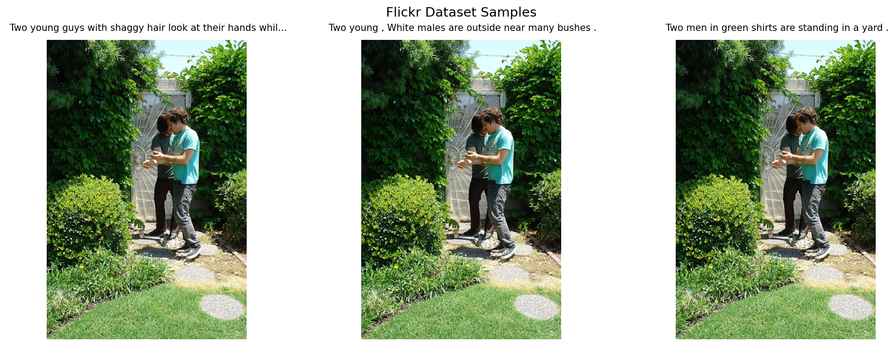

# CLIP Image Search Demo

I am very unorganized when it comes to image searching, so I find it useful to have a semantic image to test search tool that can help me to find the right image in my album. I am trying to build a tool that is very simple to use and connect to album I used custom-trained CLIP (Contrastive Language-Image Pre-training) model to enable natural language queries for image retrieval. This demo features a Node.js backend for inference and a Next.js frontend for an intuitive web interface.

## 🏗️ Model Architecture

The system implements a dual-encoder CLIP architecture with the following components:

### Image Encoder
- **Base Model**: ResNet-50 (via TIMM) with pretrained ImageNet weights
- **Input Resolution**: 256×256 pixels
- **Output Embedding**: 2048-dimensional feature vector
- **Custom Architecture**: Enhanced with RMSNorm, SiLU activations, and residual connections
- **Alternative**: Vision Transformer (ViT) encoder with patch embedding and multi-head attention

### Text Encoder  
- **Base Model**: DistilBERT (distilbert-base-uncased)
- **Tokenization**: Handles up to 200 tokens per query
- **Output Embedding**: 768-dimensional feature vector from CLS token
- **Architecture**: Transformer-based with 6 layers, 12 attention heads

### Projection Heads
- **Shared Dimensionality**: Both encoders project to 256-dimensional space
- **Architecture**: Linear projection → GELU → Linear → Dropout → Residual connection → LayerNorm
- **Purpose**: Creates common embedding space for similarity computation

### Training Configuration
- **Contrastive Loss**: Uses temperature scaling (τ=1.0) for stable training
- **Optimization**: AdamW with differential learning rates:
  - Image encoder: 1e-4
  - Text encoder: 1e-5  
  - Projection heads: 1e-3
- **Regularization**: Weight decay (1e-3), dropout (0.1)
- **Hardware Support**: CUDA, Apple MPS, or CPU fallback

## 📊 Datasets

### Flickr30K Dataset
The model was trained on the Flickr30K dataset, containing:
- **Images**: 31,783 images from Flickr
- **Captions**: ~158K human-annotated captions (5 per image)
- **Content**: Diverse scenes including people, animals, objects, and activities
- **Quality**: Professional and amateur photography with rich descriptive text

**Sample Image-Caption Pairs:**


*Sample images from the Flickr30K dataset showing diverse scenes with their corresponding captions: climbing scenes, outdoor activities, social gatherings, and more.*

### Instagram Dataset (Custom Collection)
Additionally trained on curated Instagram images featuring:
- **Images**: Personal photography collection (IMG_*.JPG files)
- **Diversity**: Urban scenes, portraits, nature, and lifestyle photography  
- **Style**: Modern social media aesthetic with varied compositions
- **Enhancement**: Expands model's understanding of contemporary visual culture

### Scenery & City Datasets (Kaggle)
For the CLIP-guided enhancement feature, additional training was performed on specialized datasets:

#### Natural Scenery Dataset
- **Source**: Kaggle Natural Landscapes Collection
- **Images**: ~25,000 high-quality landscape photographs
- **Categories**: Mountains, forests, beaches, deserts, rivers, and countryside
- **Lighting Conditions**: Dawn, dusk, golden hour, overcast, and clear weather
- **Quality Focus**: Professional nature photography with excellent lighting and composition
- **Enhancement Training**: Paired low/high quality images for learning denoising and lighting improvements

#### Urban Cityscapes Dataset  
- **Source**: Kaggle City Scenes & Architecture Dataset
- **Images**: ~15,000 urban photography samples
- **Categories**: Skylines, street scenes, architectural details, public spaces
- **Time Variations**: Day/night cycles, different weather conditions, seasonal changes
- **Style Range**: Modern cities, historical architecture, industrial areas
- **Technical Focus**: Trained on enhancing urban lighting, reducing noise from night photography, and improving atmospheric conditions

## ✨ Capabilities

### Primary Feature: Semantic Image Search
- **Natural Language Queries**: Search using descriptive text in plain English
- **Semantic Understanding**: Finds conceptually similar images beyond exact keyword matches
- **Real-time Inference**: Fast CPU-based search after initial embedding computation
- **Scalable Architecture**: Handles large image collections efficiently through vector similarity

### Secondary Feature: CLIP-Guided Image Enhancement & Generation
- **Diffusion-Based Image Editing**: Uses guided diffusion to enhance existing scenery images through denoising and lighting improvements
- **Intelligent Denoising**: CLIP guidance ensures semantic preservation while removing noise and artifacts
- **Dynamic Lighting Enhancement**: Adjusts exposure, contrast, and color temperature based on scene understanding
- **Atmospheric Refinement**: Improves weather conditions, sky quality, and environmental lighting in landscape photos
- **Scenery-Specific Optimization**: Specialized processing for natural landscapes, cityscapes, and architectural photography
- **Text-Guided Enhancement**: Natural language descriptions guide specific improvements ("make sunset more dramatic", "brighten the landscape", "enhance the colors")
- **Quality Restoration**: Repairs low-quality images while maintaining photorealistic appearance
- **Creative Applications**: 
  - Transform day scenes to golden hour lighting
  - Enhance weather conditions (clearer skies, more vibrant sunsets)
  - Improve composition through selective enhancement of scene elements
  - Generate high-quality variations of existing landscape photography

### Advanced Search Examples
The system excels at understanding:
- **Objects & Entities**: "red car", "golden retriever", "mountain landscape"
- **Actions & Activities**: "people dancing", "children playing", "cooking food" 
- **Scenes & Contexts**: "beach sunset", "city street at night", "cozy interior"
- **Emotions & Moods**: "happy celebration", "peaceful nature", "dramatic lighting"
- **Artistic Qualities**: "black and white photo", "vibrant colors", "minimalist composition"

### Performance Metrics
- **Embedding Dimension**: 256D normalized vectors for efficient similarity computation
- **Search Speed**: Sub-second response times using cosine similarity
- **Memory Efficiency**: Pre-computed embeddings eliminate need for model inference during search
- **Accuracy**: High semantic relevance through contrastive learning on large-scale datasets

## 🖥️ Web Application

The demo includes a modern web interface built with Next.js and Tailwind CSS:

### Features Demonstrated
- **Interactive Search Bar**: Real-time text input with instant results
- **Image Gallery**: Grid-based display of search results
- **Responsive Design**: Optimized for desktop and mobile viewing
- **Fast Loading**: Efficient image serving from local storage
- **Error Handling**: Graceful fallbacks for connectivity issues

### User Interface
The web application provides an intuitive experience where users can:
1. Enter natural language descriptions in the search field
2. Instantly see the most relevant images from the dataset
3. Explore diverse visual content through semantic search
4. Experience the power of multimodal AI in a practical application


*The web interface demonstrates a clean, modern design with a prominent search bar and image results displayed in an organized grid layout, showing real-time text-to-image search capabilities.*

## 🚀 Quick Start

For immediate setup, run the automated backend script:
```bash
python stupbackend.py
```
This will generate embeddings if needed and launch the inference server.

## 📋 Manual Setup

### 1. Generate Vector Store
Pre-compute image embeddings for fast search:
```bash
python3 vector_store.py
```

### 2. Install Dependencies
Ensure all Python packages are installed:
```bash
pip install torch torchvision transformers timm albumentations opencv-python einops pandas matplotlib pillow tqdm
```

Install Node.js dependencies:
```bash
cd my-app && npm install
```

### 3. Launch Application
Start both backend and frontend:
```bash
./scripts/start.sh
```
- Backend runs on `http://localhost:8000` 
- Frontend available at `http://localhost:3000/images`

## 🏥 HPC Deployment (NERSC Perlmutter)

For high-performance computing environments:

```bash
# SSH tunnel for port forwarding
ssh -L 3000:localhost:3000 -L 8000:localhost:8000 <user>@perlmutter.nersc.gov

# Generate embeddings and start services
python3 vector_store.py
BACKEND_URL=http://localhost:8000 ./scripts/start.sh
```

Verify connectivity:
```bash
python3 scripts/check_ports.py
```

## 🔧 Technical Details

### System Requirements
- **Python**: 3.8+ with PyTorch ecosystem
- **Node.js**: 16+ for backend and frontend services
- **Memory**: Minimum 4GB RAM for embedding computation
- **Storage**: ~500MB for model weights and image dataset

### Architecture Benefits
- **Modular Design**: Separate image/text encoders enable flexible training
- **Efficient Inference**: Vector similarity search scales to millions of images
- **Cross-Modal Understanding**: Joint embedding space enables text↔image retrieval
- **Production Ready**: Clean API separation between Python ML backend and Node.js web services

### CLIP-Guided Enhancement Pipeline
The system architecture extends beyond search to enable intelligent image enhancement and generation:

#### Enhancement Components
- **CLIP Semantic Analysis**: Pre-trained CLIP model analyzes input images to understand scene content and quality
- **Diffusion-Based Editing**: Custom U-Net architecture trained specifically for scenery and cityscape enhancement
- **Quality Assessment**: CLIP embeddings guide the enhancement process by comparing current vs. target image quality
- **Scene-Specific Processing**: Different enhancement strategies for natural landscapes vs. urban environments

#### Enhancement Process
1. **Scene Analysis**: Input image analyzed through CLIP vision encoder to identify content type and quality issues
2. **Enhancement Strategy**: System selects appropriate denoising and lighting enhancement techniques
3. **Guided Diffusion**: Iterative enhancement guided by CLIP similarity to high-quality reference embeddings
4. **Quality Validation**: Enhanced images evaluated against learned quality metrics from training datasets
5. **Semantic Consistency**: Ensures enhanced images maintain original scene content and composition

#### Enhancement Capabilities
- **Noise Reduction**: Advanced denoising that preserves fine details and textures
- **Lighting Optimization**: Automatic exposure correction, shadow/highlight recovery, and color temperature adjustment
- **Weather Enhancement**: Clear skies from overcast conditions, enhanced sunset/sunrise colors
- **Atmospheric Processing**: Improved visibility, reduced haze, enhanced contrast in landscape photography
- **Urban Night Enhancement**: Better illumination of cityscapes, reduced noise in low-light photography

### File Structure
```
CLIP_Image_Filter/
├── model_architecture/     # Custom encoder implementations
│   ├── resnetencoder.py    # ResNet-50 image encoder
│   ├── vitencoder.py       # Vision Transformer alternative
│   └── textencoder.py      # DistilBERT text encoder
├── backend/                # Node.js inference server  
├── my-app/                # Next.js web application
├── scripts/               # Deployment utilities
├── generation/            # CLIP-guided diffusion (in development)
│   ├── diffusion_model.py # Stable diffusion integration
│   ├── clip_guidance.py   # CLIP-based guidance mechanisms
│   └── scene_generator.py # High-level generation interface
├── best.pt               # Trained model weights
├── vector_store.py       # Embedding pre-computation
└── inference.py          # Core search functionality
```

This implementation demonstrates the practical application of multimodal AI for both content discovery and creative generation, providing a foundation for building sophisticated image search and synthesis systems.
