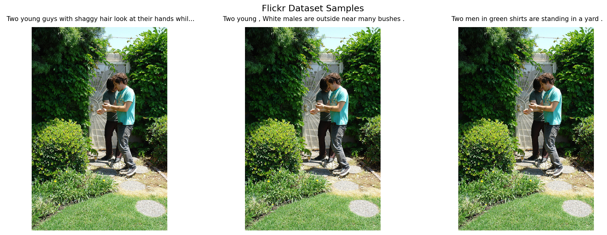

# CLIP Image Search Demo

I am very unorganized when it comes to image searching and lazy when it comes to editing, so I find it useful to have a semantic image search tool that can help me to find the right image in my album and an editor to make the image look better. It would be even better if there is an interactive chatbot that I can talk to about the images. I used custom-trained CLIP (Contrastive Language-Image Pre-training) model to enable natural language queries for image retrieval and used a CLIP-guided diffusion model for image editing. I also integrated the CLIP with a NanoGPT/TinyLLama backbone roughly following the structure of the BLIP paper. This demo features a Node.js backend for inference and a Next.js frontend for an intuitive web interface. Because I want to practise my understanding in ML all of these models are trained from scratch.

## ✨ Capabilities

### Primary Feature: Semantic Image Search
- **Natural Language Queries**: Search using descriptive text in plain English
- **Semantic Understanding**: Finds conceptually similar images, wtihout the need of captions
- **Real-time Inference**: Fast CPU-based search after initial embedding computation

### Secondary Feature: CLIP-Guided Image Enhancement & Generation
- **Diffusion-Based Image Editing**: Uses guided diffusion to enhance existing scenery images through denoising and lighting improvements
- **Intelligent Denoising**: CLIP guidance ensures semantic preservation while removing noise and artifacts
- **Dynamic Lighting Enhancement**: Adjusts exposure, contrast, and color temperature based on scene understanding

## 🏗️ Model Architecture

The system implements a dual-encoder CLIP architecture with the following components:

### Image Encoder
- **Base Model**: ResNet-50 (via TIMM) with pretrained ImageNet weights, alternative VIT
- **Input Resolution**: 256×256 pixels

### Text Encoder  
- **Base Model**: DistilBERT (distilbert-base-uncased)

### Projection Heads and Transfer head
- **Architecture**: Linear projection → GELU → Linear → Dropout → Residual connection → LayerNorm
- **Purpose**: Creates common embedding space for similarity computation

### Backbone
- Choice between pretrained GPT2-large and TinyLLama

## 📊 Datasets

### Flickr30K Dataset
The model was trained on the Flickr30K dataset, containing:
- **Images**: 31,783 images from Flickr
- **Captions**: ~158K human-annotated captions (5 per image)
- **Content**: Diverse scenes including people, animals, objects, and activities
- **Quality**: Professional and amateur photography with rich descriptive text

**Sample Image-Caption Pairs:**


*Sample images from the Flickr30K dataset showing diverse scenes with their corresponding captions: climbing scenes, outdoor activities, social gatherings, and more.*

### Instagram Dataset (Custom Collection)
Additionally trained on curated Instagram images featuring:
- **Images**: Personal photography collection (IMG_*.JPG files)

#### Natural Scenery Dataset
- **Source**: Kaggle Natural Landscapes Collection
- **Images**: ~25,000 high-quality landscape photographs
- **Categories**: Mountains, forests, beaches, deserts, rivers, and countryside


## ✨ Capabilities

### Primary Feature: Semantic Image Search
- **Natural Language Queries**: Search using descriptive text in plain English
- **Semantic Understanding**: Finds conceptually similar images, wtihout the need of captions
- **Real-time Inference**: Fast CPU-based search after initial embedding computation

### Secondary Feature: CLIP-Guided Image Enhancement & Advicing
- **Diffusion-Based Image Editing**: Uses guided diffusion to enhance existing scenery images through denoising and lighting improvements
- **Captioning**: The trained backbone can generate captioning that is quite good.


*The web interface demonstrates a clean, modern design with a prominent search bar and image results displayed in an organized grid layout, showing real-time text-to-image search capabilities.*

## 🚀 Quick Start

For immediate setup, run the automated backend script:
```bash
python stupbackend.py
```
This will generate embeddings if needed and launch the inference server.
```

This implementation demonstrates the practical application of multimodal AI for both content discovery and creative generation, providing a foundation for building sophisticated image search and synthesis systems.
